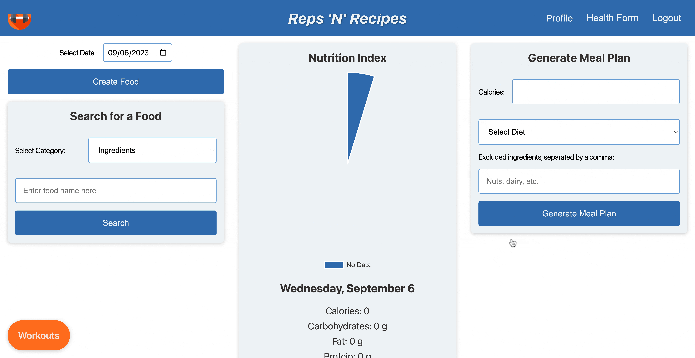
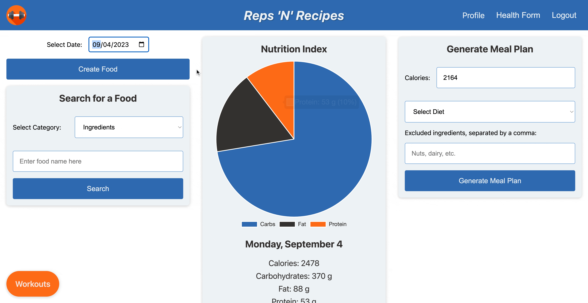

# Reps 'N Recipes

Reps 'N Recipes is a one-stop fitness app designed to help users achieve their health and wellness goals. Instead of juggling multiple apps to track workouts, nutrition, and progress, this app combines these features into a single platform.

# [LIVE](https://reps-n-recipes-d98cf03910d0.herokuapp.com/)

## Technologies Used

- **MongoDB:** A NoSQL database that stores data in a flexible, JSON-like format. Ideal for unstructured data and easier to scale horizontally.

- **Express.js:** A web application framework for Node.js that simplifies tasks like routing, API creation, and interacting with databases.

- **React.js:** A JavaScript library for building dynamic user interfaces. It excels in creating reusable components and managing state.

- **Node.js:** A JavaScript runtime that allows you to run JavaScript on the server. It's non-blocking and event-driven, which makes it efficient for scalable applications.

- **Chart.js** A data visualization library, that can be integrated with React to create charts/graphs. Reps 'N' Recipes integrated Chart.js to visualize the user's daily nutrition, and their calories, macros, weight, and exercises over time.

- **Redux** is a state management library often used with React. It provides a centralized store for state that is needed across the entire application. Redux makes it easier to manage global state, especially in larger applications.

- **Spoonacular** is an API that provides a broad range of food and nutrition data. This API is the source of the nutrition information for the app's food database, as well as the meal planning and tracking component. We leveraged the API endpoints for ingredients,products, recipes, menu items, and meal plan generation.

- **Amazon Web Services (AWS) S3** is a storage service that allows for scalable and secure storage of files. Reps 'N' Recipes utilizes S3 to store exercise GIFs so that users can see the exercise they are adding to their workout.

## Features

### User Profile & Customization

Upon signing up, users can complete a short survey about their physical measurements and goals. This will generate estimates for their total daily energy expenditure (TDEE) and recommended daily caloric intake.

### Workout Tracking

Choose A Pre-set Workout and Go! Or, create your own workout from scratch by adding and/or removing exercises and sets. We offer a variety of exercises, complete with how-to GIFs.

Log the weight you used and the number of repetitions you completed! Then, re-visit your previous workouts to ensure you are making progress each workout.

### Nutrition Tracking

Search Spoonacular's database of ingredients, food products, recipes, and menu items. Select the one that matches what you ate that day, adjust the quantity, and record it.

Decided you want to have seconds? No problem, simply update the quantity. View your macronutrient breakdown for each day by flipping through the calendar.

If you aren't sure how to meet your calorie goals for a particular day, generate a meal plan suited to your goals in one click.

### User Profile

Update your weight daily, changing your estimated TDEE instantly, mitigating plateaus.

View your caloric and macronutrient intake over time, your weight over time, and your estimated 1-rep max of any exercise in our database, calculated from workouts you have recorded!

## Code Snippets

## Background and Overview

Reps 'N Recipes if a fitness app designed to help users achieve their health and wellness goals. There's a variety of fitness apps out there, but they either allow users to track their workouts or nutrition. Rather than requiring two apps, Reps 'N Recipes combines both those features into one simple app. 

The app features a database of built-in exercises with GIFs for users to see how to perform the movement, and they can input exercises manually if they are not in the database. For beginners, the app also generates workouts for the user to follow to make their fitness journey easier. 

Additionally, Reps 'N Recipes features Spoonacular API for easy meal tracking by searching for the ingredient and inputting the number of servings in their preferred unit of measurement, as well as the ability to generate a meal plan for the day based on the user's parameters.

## Functionality and MVP

1. Upon signing up for the application, users will fill out a short survey about their physical parameters, health & fitness goals, and exercise preferences.  On their profile, the user will be able to see visualized data of their progress, in terms of weight or estimated 1-rep-max by exercise, over a certain timeframe. 

2. The application will have pre-set resistance training plans that the user can simply click on and follow while they are in the gym, or adjust individual exercises to better suit their personal needs. 

3. The app will provide an interface upon which the user can track their workouts by sets and repetitions, storing this information for future workouts to built the charts displayed on the user's profile and encourage progressive overload in the gym, a core pillar of muscle strength and hypertrophy.

4. On another tab, the app will take the user's personal information obtained by the aforementioned survey and provide a suggestion for the preliminary total daily caloric intake that will help the user achieve their weight goals. The user will be able to input the exact type and quantity of any food they consumed on a particular day, allowing them to track their diet and adhere to their recommended macronutrient intake. This feature will display the user's remaining calories and consumed macronutrients to help them plan out the rest of their nutrition for that day and in the future.

5. **Bonus:** Social media-like communication between users allowing them to see each others progress 

## Technologies 

Technologies:

- **MongoDB:** A NoSQL database that stores data in a flexible, JSON-like format. Ideal for unstructured data and easier to scale horizontally.

- **Express.js:** A web application framework for Node.js that simplifies tasks like routing, API creation, and interacting with databases.

- **React.js:** A JavaScript library for building dynamic user interfaces. It excels in creating reusable components and managing state.

- **Node.js:** A JavaScript runtime that allows you to run JavaScript on the server. It's non-blocking and event-driven, which makes it efficient for scalable applications.

- Data visualization library such as **Recharts** or **Chart.js**, that can be integrated with React to create charts/graphs. These libraries can be used to display complex data in a graphical form, like the user's progress over time, or caloric and macronutrient intake.

- **Redux** is a state management library often used with React. It provides a centralized store for state that is needed across the entire application. Redux makes it easier to manage global state, especially in larger applications.

- **Spoonacular** is an API that provides a broad range of food and nutrition data. From recipes to meal planning and nutrient information, this API could be crucial in adding the dietary planning and tracking component to Reps 'N Recipes.

- **Amazon Web Services (AWS) S3** is a storage service that allows for scalable and secure storage of files. You can store anything from documents to images and videos. For Reps 'N Recipes, S3 could be used to store exercise GIFs, user profile pictures, or any other media.

## Technical Challenges

- Database performance might be slow with the volume of exercises and GIFs stored, as well as the constant queries to the Spoonacular API
- Spoonacular API usage rate limits and response speed
- Ensuring clear communication between MongoDB/Express backend (BE) and React/Redux frontend (FE)
- Working on the BE/FE of multiple features concurrently, keeping variables and FE state clean (i.e., minimally nested)

## Group Members and Work Breakdown

- Stefan Lazarevic - Project Lead
- Elliot Chang
- Nico Carlier

### 08/28/23
- Build out backend for user auth
- Build out frontend for user auth
- Map out data structure and seeds

### 08/29/23
- Build out seeds file
- Spoonacular API integration
- Create fitness components/forms

### 08/30/23
- Build out user profile page and form to update goals
- Create nutrition components/forms
- Create daily tracker component
- CSS styling

### 08/31/23
- Continue building out components
- Build out home page
- CSS styling

### 09/01/23
- Testing and debugging
- CSS styling
